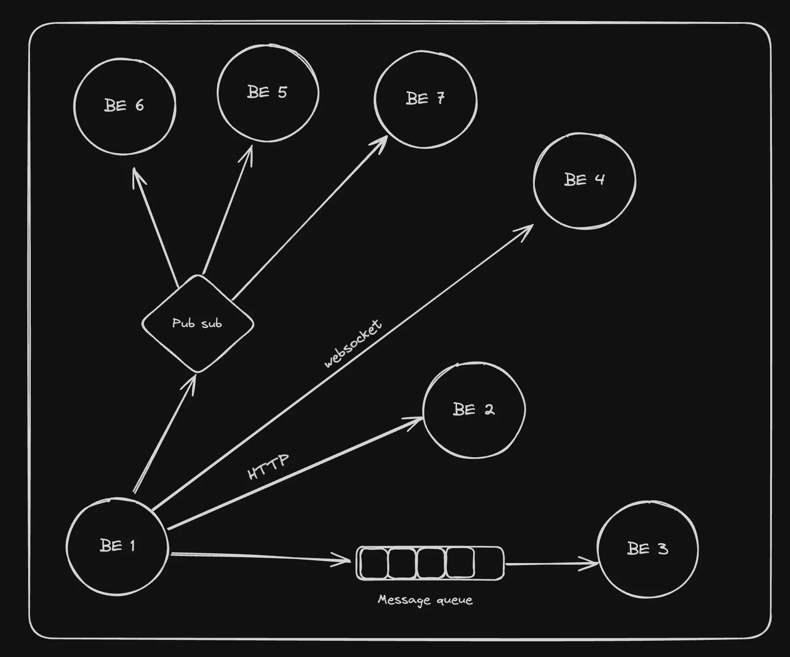

# Websockets and Advance Backend communication

## What is backend communication?

- In the real world, you have various backend systems, not just one.



- For example, for a website like PayTM, whenever you do a transaction, the following might happen


- For leetcode, whenever the user submits a problem, the following might happen - 


## Types of communication

1. **Synchronous (Strong coupling)** : 

    - HTTP (REST/GraphQL)
    - Websocket (debatable if sync or async)


 
2. **Asynchronous (Weak coupling)** :

    - Messaging queues
    - Pub subs
    - Server-Sent Events 
    - Websocket (debatable if sync or async)

## Websockets : 

WebSockets provide a way to establish a persistent, full-duplex communication channel over a single TCP connection between the client (typically a web browser) and the server.


**Use Cases for WebSockets :**

- **Real-Time Applications:** Chat applications, live sports updates, real-time gaming, and any application requiring instant updates can benefit from WebSockets.

- **Live Feeds:** Financial tickers, news feeds, and social media updates are examples where WebSockets can be used to push live data to users.

- **Interactive Services:** Collaborative editing tools, live customer support chat, and interactive webinars can use WebSockets to enhance user interactio
 
Good example - https://www.binance.com/en/trade/SOL_USDT?type=spot

**Why not use HTTP/REST? Why do you need ws?**


1. Network Handshake happens for every request

2. No way to push server side events (You can use polling but not the best approach)


## Websockets in Node.js : 

There are various libraries that let you create a ws server (similar to how express lets you create an HTTP server)

1. https://www.npmjs.com/package/websocket
2. https://github.com/websockets/ws
3. https://socket.io/
 
We’ll be using the ws library today. 
 
    💡 Problems with socket.io - 
    Even though socket.io is great (it gives you constructs like rooms to make the API much cleaner), it’s harder to support multiple platforms in it (Android, IOS, Rust). 
    There are implementations in most platforms but not very up to date 
    https://socket.io/blog/native-socket-io-and-android/
    https://github.com/1c3t3a/rust-socketio

## Ws in Node.js (Code) :
 
- Initialize an empty Node.js project :
```bash
npm init -y
```

- Add tsconfig to it : 
```bash
npx tsc --init
```

- Update tsconfig : 
```bash
"rootDir": "./src",
"outDir": "./dist",
```

- Install ws :
```bash
npm i ws @types/ws
```
 
- Code using http library : 
```ts
import WebSocket, { WebSocketServer } from 'ws';
import http from 'http';

const server = http.createServer(function(request: any, response: any) {
    console.log((new Date()) + ' Received request for ' + request.url);
    response.end("hi there");
});

const wss = new WebSocketServer({ server });

wss.on('connection', function connection(ws) {
  ws.on('error', console.error);

  ws.on('message', function message(data, isBinary) {
    wss.clients.forEach(function each(client) {
      if (client.readyState === WebSocket.OPEN) {
        client.send(data, { binary: isBinary });
      }
    });
  });

  ws.send('Hello! Message From Server!!');
});

server.listen(8080, function() {
    console.log((new Date()) + ' Server is listening on port 8080');
});
```
 
- Code using express : 
```bash
npm install express @types/express
```

```ts
import express from 'express'
import { WebSocketServer } from 'ws'

const app = express()
const httpServer = app.listen(8080)

const wss = new WebSocketServer({ server: httpServer });

wss.on('connection', function connection(ws) {
  ws.on('error', console.error);

  ws.on('message', function message(data, isBinary) {
    wss.clients.forEach(function each(client) {
      if (client.readyState === WebSocket.OPEN) {
        client.send(data, { binary: isBinary });
      }
    });
  });

  ws.send('Hello! Message From Server!!');
});
```

## Client side code : 

Websocket  is a browser API that you can access (very similar to fetch) Will work in a raw project , React project and Next project (needs to be client side).
 
- Create a React project :
```bash
npm create vite@latest
```

- Create a websocket connection to the server :
```ts
import { useEffect, useState } from 'react'
import './App.css'

function App() {
  const [socket, setSocket] = useState<WebSocket | null>(null);

  useEffect(() => {
    const newSocket = new WebSocket('ws://localhost:8080');
    newSocket.onopen = () => {
      console.log('Connection established');
      newSocket.send('Hello Server!');
    }
    newSocket.onmessage = (message) => {
      console.log('Message received:', message.data);
    }
    setSocket(newSocket);
    return () => newSocket.close();
  }, [])

  return (
    <>
      hi there
    </>
  )
}

export default App
```

    💡 Can you convert it to a custom hook called useSocket ?

## WebSockets in Next.js :

- Create a fresh next project.

- Update page.tsx to be a client component.

- Add the code to create a socket connection.
```ts
"use client"
import { useEffect, useState } from 'react'

export default function() {
  const [socket, setSocket] = useState<WebSocket | null>(null);

  useEffect(() => {
    const newSocket = new WebSocket('ws://localhost:8080');
    newSocket.onopen = () => {
      console.log('Connection established');
      newSocket.send('Hello Server!');
    }
    newSocket.onmessage = (message) => {
      console.log('Message received:', message.data);
    }
    setSocket(newSocket);
    return () => newSocket.close();
  }, [])

  return (
    <>
      hi there
    </>
  )
}
```

## Scaling ws servers : 

- In the real world, you’d want more than one websocket servers (Especially as your website gets more traffic).

- The way to scale websocket servers usually happens by creating a ws fleet.

- There is usually a central layer behind it that orchestrates  messages. 

- ws servers are kept stateless.

