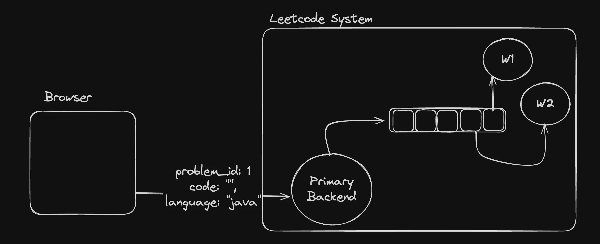
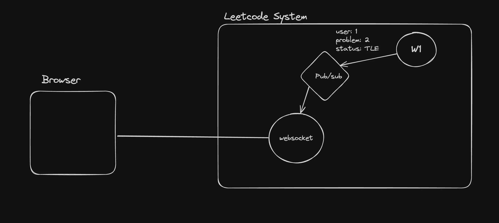
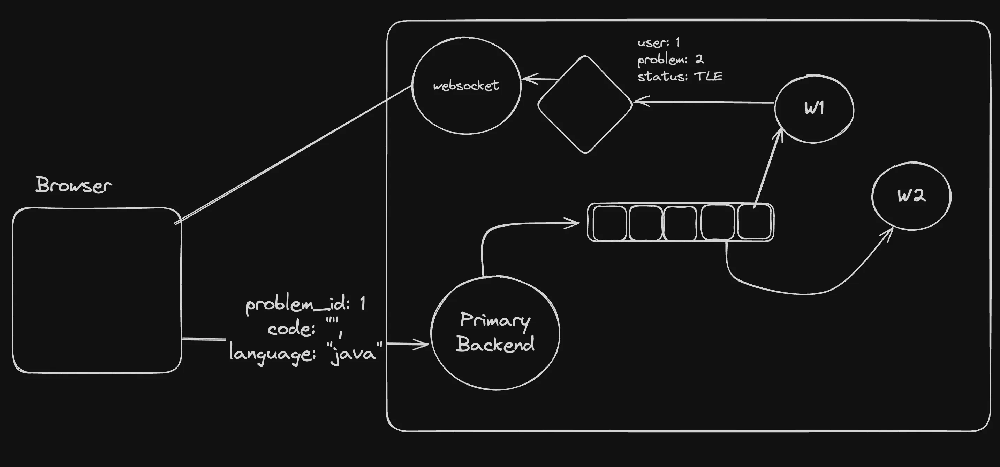
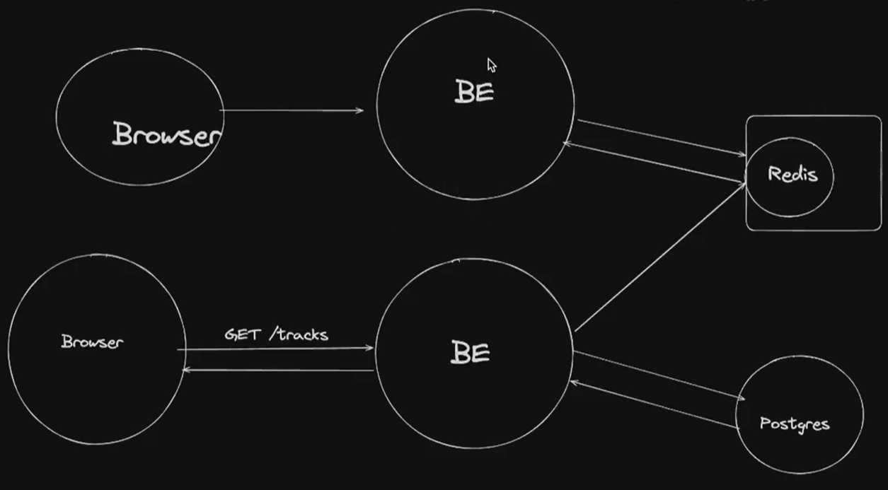
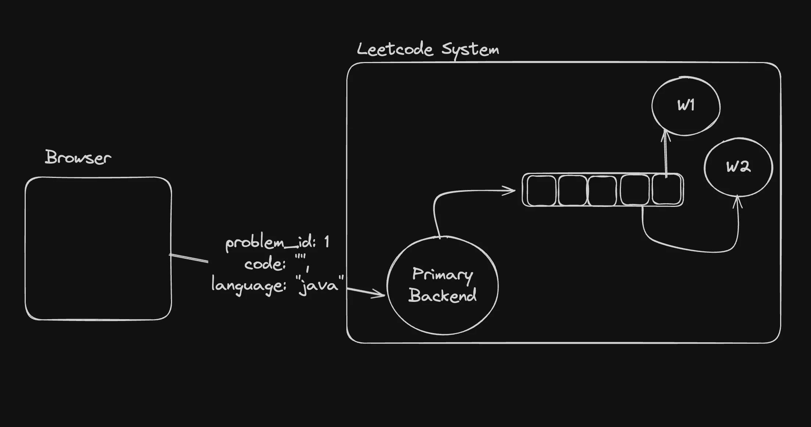
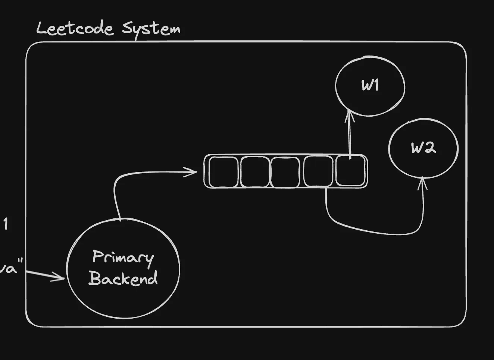

## What are we learning?

    💡Pre-requisites - You need to have docker installed on your machine

1. Queues
2. Pub subs
3. Redis

More specifically, we’re learning how we would build a system like leetcode

**Part 1 - Queues** :


**Part 2 (Assignment) - Pub subs** :


**Final Architecture** :


## Redis : 

- Redis is an open-source, in-memory data structure store, used as a database, cache, and message broker.

- One of the key features of Redis is its ability to keep all data in memory, which allows for high performance and low latency access to data. 


**In memory data structure store :**

Very similar to a DB, only it is in memory. That doesn’t mean it doesn’t have persistence.

- **RDB (Redis Database File) :** The RDB persistence performs point-in-time snapshots of your dataset at specified intervals. It creates a compact single-file representation of the entire Redis dataset. The snapshotting process can be configured to run at specified intervals, such as every X minutes if Y keys have changed.

```yml
save 900 1       # Save the dataset every 900 seconds if at least 1 key changed
save 300 10      # Save the dataset every 300 seconds if at least 10 keys changed
save 60 10000    # Save the dataset every 60 seconds if at least 10000 keys changed
```

- **AOF (Append Only File) :** The AOF persistence logs every write operation received by the server, appending each operation to a file. This file can then be replayed on startup to reconstruct the dataset. 
 
**Distributed Caching :**


## Starting redis locally : 

- Let’s start redis locally and start using it as a DB :
```bash
docker run --name my-redis -d -p 6379:6379 redis
```

- Connecting to your container : 
```bash
docker exec -it container_id /bin/bash
```

- Connecting to the redis cli
```bash
redis-cli
```

## Redis as a DB : 

**SET/GET/DEL :** For storing simple data

- Setting data : 
```bash
SET mykey "Hello" 
```

- Getting data :
```bash
GET mykey
```

- Deleting data :
```bash
DEL mykey
```
 
**HSET/HGET/HDEL (H = Hash) :** For storing complex data
```bash
HSET user:100 name "John Doe" email "user@example.com" age "30"
HGET user:100 name
HGET user:100 email
```
 
    💡 You should never use redis as your primary database. Very nice video - https://www.youtube.com/watch?v=WQ61RL1GpEE

## Redis as a queue : 

- You can also push to a topic / queue on Redis and other processes can pop from it.

- Good example of this is Leetcode submissions that need to be processed asynchronously.



**Pushing to a queue :**
```bash
LPUSH problems 1
LPUSH problems 2
```

NOTE : Letter "L" in "LPUSH" is "Left". Push from the left side.
 
**Popping from a queue :**
```bash
RPOP problems
RPOP problems 
```
 
**Blocked pop :**
```bash
BRPOP problems 0
BRPOP problems 30
```

The last argument represents the timeout before the blocking should be stopped.

## Talking to redis via Node.js : 

There are various clients that exist that let you talk to redis via Node.js
https://www.npmjs.com/package/redis
 
Let’s initialize a simple Node.js express server that takes a problem submission (very similar to leetcode) as input and sends it to the queue.

Let’s also create a worker service that picks up a problem, waits for 2 seconds and then proceeds to pick the next one.



**Code :**

- Create an empty `Node.js` project.

- Initialize 2 folders inside it :
    - express-server
    - worker

- Initialize an empty Node.js typescript project in both of them : 
```bash
npm init -y
npx tsc --init
```

- Install dependencies in express-server : 
```bash
npm i express @types/express redis
```

- Install dependencies in worker :
```bash
npm i redis
```

- Create `index.ts` in express-server : 
```ts
import express from "express";
import { createClient } from "redis";

const app = express();
app.use(express.json());

const client = createClient();
client.on('error', (err) => console.log('Redis Client Error', err));

app.post("/submit", async (req, res) => {
    const problemId = req.body.problemId;
    const code = req.body.code;
    const language = req.body.language;

    try {
        await client.lPush("problems", JSON.stringify({ code, language, problemId }));
        // Store in the database
        res.status(200).send("Submission received and stored.");
    } catch (error) {
        console.error("Redis error:", error);
        res.status(500).send("Failed to store submission.");
    }
});

async function startServer() {
    try {
        await client.connect();
        console.log("Connected to Redis");

        app.listen(3000, () => {
            console.log("Server is running on port 3000");
        });
    } catch (error) {
        console.error("Failed to connect to Redis", error);
    }
}

startServer();
```

- Create `index.ts` in worker : 
```bash
import { createClient } from "redis";
const client = createClient();

async function processSubmission(submission: string) {
    const { problemId, code, language } = JSON.parse(submission);

    console.log(`Processing submission for problemId ${problemId}...`);
    console.log(`Code: ${code}`);
    console.log(`Language: ${language}`);
    // Here you would add your actual processing logic

    // Simulate processing delay
    await new Promise(resolve => setTimeout(resolve, 1000));
    console.log(`Finished processing submission for problemId ${problemId}.`);
}

async function startWorker() {

    try {
        await client.connect();
        console.log("Worker connected to Redis.");

        // Main loop
        while (true) {
            try {
                const submission = await client.brPop("problems", 0);
                // @ts-ignore
                await processSubmission(submission.element);
            } catch (error) {
                console.error("Error processing submission:", error);
                // Implement your error handling logic here. For example, you might want to push
                // the submission back onto the queue or log the error to a file.
            }
        }
    } catch (error) {
        console.error("Failed to connect to Redis", error);
    }
}

startWorker();
```

    💡Can u figure out why I had to add a ts-ignore ? Why is the type of submission string?